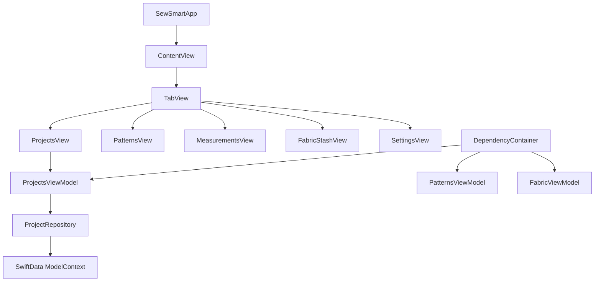

# SewSmart iOS App - Code Review & Improvement Recommendations

## Overview

SewSmart is an iOS SwiftUI application designed for sewing enthusiasts to manage their projects, patterns, measurements, and fabric inventory. The app follows modern iOS development patterns using SwiftUI and SwiftData for persistence.

**Repository Type**: iOS Mobile Application (SwiftUI/SwiftData)

## Architecture Analysis

### Current Architecture Strengths
- ✅ **Modern SwiftUI Implementation**: Uses current SwiftUI patterns and lifecycle
- ✅ **MVVM Pattern**: Clear separation between Views and ViewModels
- ✅ **Repository Pattern**: Clean data access layer with protocol abstractions
- ✅ **Dependency Injection**: Proper DI container implementation
- ✅ **SwiftData Integration**: Modern Core Data replacement
- ✅ **Comprehensive Testing**: Good test coverage with both XCTest and Swift Testing



## Critical Issues Identified

### 1. **Data Persistence Inconsistency** 🔴
**Issue**: The project shows conflicting data persistence approaches

**Current Problems**:
- Legacy Core Data code exists alongside SwiftData implementation
- `PersistenceController` in `SewSmartApp.swift` uses Core Data patterns
- Views use both `@FetchRequest` and `@Query` annotations
- Mixed usage of `managedObjectContext` and `modelContext`

**Impact**: Data corruption, migration issues, and confusing codebase

**Recommendation**:
```swift
// Remove Core Data completely and standardize on SwiftData
@main
struct SewSmartApp: App {
    var body: some Scene {
        WindowGroup {
            ContentView()
        }
        .modelContainer(for: [Project.self, Pattern.self, Fabric.self])
    }
}
```

### 2. **Duplicate View Implementations** 🔴
**Issue**: Multiple versions of the same views exist

**Problems Found**:
- `ContentView.swift` exists in both root and `SewSmart/` directories
- Different implementations of `ProjectsView` causing confusion
- Inconsistent UI patterns between views

**Recommendation**: Consolidate to single source of truth for each view

### 3. **Error Handling Issues** 🟡
**Issue**: Inconsistent and dangerous error handling patterns

**Problems**:
```swift
// Dangerous: Using fatalError in production code
fatalError("Unresolved error \(nsError), \(nsError.userInfo)")
```

**Better Approach**:
```swift
// Graceful error handling
do {
    try viewContext.save()
} catch {
    logger.error("Failed to save: \(error)")
    showErrorAlert = true
    errorMessage = "Unable to save project. Please try again."
}
```

### 4. **Memory Management Concerns** 🟡
**Issue**: Potential memory leaks and retention cycles

**Problems**:
- ViewModels holding strong references to repositories
- Lack of proper cleanup in view lifecycle
- Missing `@MainActor` isolation in some async operations

### 5. **UI/UX Inconsistencies** 🟡
**Issue**: Mixed design patterns across the application

**Problems**:
- Inconsistent color schemes and typography
- Mixed navigation patterns (NavigationView vs NavigationStack)
- Placeholder views for core features (Patterns, Measurements, Fabric)

## Detailed Improvement Recommendations

### Data Layer Improvements

#### 1. Standardize on SwiftData
```swift
// Remove all Core Data imports and implementations
// Standardize model definitions
@Model
final class Project {
    var id: UUID = UUID()
    var name: String = ""
    var projectDescription: String = ""
    var status: ProjectStatus = .planning
    var progress: Double = 0.0
    var createdDate: Date = Date()
    var updatedDate: Date = Date()
    
    init(name: String, description: String = "", status: ProjectStatus = .planning) {
        self.name = name
        self.projectDescription = description
        self.status = status
    }
}
```

#### 2. Implement Proper Error Types
```swift
enum SewSmartError: LocalizedError {
    case dataCorruption
    case networkUnavailable
    case invalidInput(String)
    case storageUnavailable
    
    var errorDescription: String? {
        switch self {
        case .dataCorruption:
            return "Data corruption detected"
        case .networkUnavailable:
            return "Network connection unavailable"
        case .invalidInput(let field):
            return "Invalid input for \(field)"
        case .storageUnavailable:
            return "Storage unavailable"
        }
    }
}
```

### Architecture Improvements

#### 1. Repository Pattern Enhancement
```swift
protocol ProjectRepositoryProtocol: Sendable {
    func fetchAll() async throws -> [Project]
    func save(_ project: Project) async throws
    func delete(_ project: Project) async throws
    func update(_ project: Project) async throws
}

actor ProjectRepository: ProjectRepositoryProtocol {
    private let modelContext: ModelContext
    
    func fetchAll() async throws -> [Project] {
        // Implementation with proper error handling
    }
}
```

#### 2. ViewModel State Management
```swift
@MainActor
@Observable
class ProjectsViewModel {
    enum LoadingState {
        case idle
        case loading
        case loaded([Project])
        case error(SewSmartError)
    }
    
    var loadingState: LoadingState = .idle
    private let repository: ProjectRepositoryProtocol
    
    func loadProjects() async {
        loadingState = .loading
        do {
            let projects = try await repository.fetchAll()
            loadingState = .loaded(projects)
        } catch {
            loadingState = .error(.dataCorruption)
        }
    }
}
```

### UI/UX Improvements

#### 1. Design System Standardization
```swift
struct DesignSystem {
    // Colors
    static let primaryColor = Color("Primary")
    static let secondaryColor = Color("Secondary")
    static let backgroundColor = Color("Background")
    
    // Typography
    static let titleFont = Font.title.weight(.bold)
    static let bodyFont = Font.body
    static let captionFont = Font.caption
    
    // Spacing
    static let paddingSmall: CGFloat = 8
    static let paddingMedium: CGFloat = 16
    static let paddingLarge: CGFloat = 24
}
```

#### 2. Consistent Navigation
```swift
// Replace all NavigationView with NavigationStack
struct ProjectsView: View {
    var body: some View {
        NavigationStack {
            // Content
        }
    }
}
```

### Testing Improvements

#### 1. Mock Implementations
```swift
class MockProjectRepository: ProjectRepositoryProtocol {
    var projects: [Project] = []
    var shouldThrowError = false
    
    func fetchAll() async throws -> [Project] {
        if shouldThrowError {
            throw SewSmartError.dataCorruption
        }
        return projects
    }
}
```

#### 2. UI Testing Strategy
```swift
// Add UI tests for critical user flows
func testProjectCreationFlow() {
    let app = XCUIApplication()
    app.launch()
    
    app.tabBars.buttons["Projects"].tap()
    app.navigationBars.buttons["Add"].tap()
    // Test flow
}
```

## Performance Optimizations

### 1. SwiftData Query Optimization
```swift
// Use specific fetch descriptors instead of fetching all data
@Query(
    filter: #Predicate<Project> { project in
        project.status == .inProgress
    },
    sort: \Project.updatedDate,
    order: .reverse
) 
var activeProjects: [Project]
```

### 2. Image Handling Optimization
```swift
// Implement proper image caching and resizing
struct OptimizedImageView: View {
    let imageData: Data
    
    var body: some View {
        AsyncImage(url: URL(data: imageData)) { image in
            image
                .resizable()
                .aspectRatio(contentMode: .fill)
        } placeholder: {
            ProgressView()
        }
        .frame(width: 100, height: 100)
        .clipShape(RoundedRectangle(cornerRadius: 8))
    }
}
```

## Security Considerations

### 1. Data Validation
```swift
extension Project {
    var isValid: Bool {
        !name.trimmingCharacters(in: .whitespacesAndNewlines).isEmpty &&
        progress >= 0.0 && progress <= 1.0
    }
}
```

### 2. Input Sanitization
```swift
func sanitizeInput(_ input: String) -> String {
    input.trimmingCharacters(in: .whitespacesAndNewlines)
         .replacingOccurrences(of: "\n", with: " ")
         .prefix(100) // Limit length
         .description
}
```

## Testing Strategy Enhancement

### 1. Unit Test Coverage Goals
| Component | Current | Target |
|-----------|---------|---------|
| ViewModels | ~70% | 95% |
| Repositories | ~60% | 90% |
| Models | ~40% | 85% |
| UI Components | ~10% | 60% |

### 2. Integration Testing
```swift
class ProjectIntegrationTests: XCTestCase {
    func testProjectWorkflow() async throws {
        // Test complete user workflow
        let container = ModelContainer(for: Project.self, inMemory: true)
        let repository = ProjectRepository(modelContext: container.mainContext)
        let viewModel = ProjectsViewModel(repository: repository)
        
        // Test creation -> update -> deletion flow
    }
}
```

## Immediate Action Items

### Priority 1 (Critical) 🔴
1. **Remove Core Data dependencies** - Standardize on SwiftData
2. **Consolidate duplicate views** - Remove conflicting implementations  
3. **Replace fatalError calls** - Implement graceful error handling
4. **Fix memory leaks** - Add proper cleanup and weak references

### Priority 2 (Important) 🟡
1. **Implement design system** - Create consistent UI components
2. **Add comprehensive error handling** - User-friendly error messages
3. **Optimize performance** - Implement proper data fetching strategies
4. **Enhance testing coverage** - Add missing unit and integration tests

### Priority 3 (Nice to Have) 🟢
1. **Add accessibility support** - VoiceOver and Dynamic Type
2. **Implement offline capabilities** - Local data persistence
3. **Add analytics and logging** - User behavior tracking
4. **Performance monitoring** - Crash reporting and metrics

## Code Quality Metrics

| Metric | Current | Target |
|--------|---------|---------|
| Test Coverage | ~55% | 85% |
| Code Duplication | High | Low |
| Cyclomatic Complexity | Medium | Low |
| Technical Debt | High | Low |
