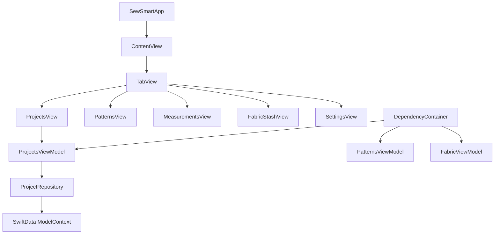

# SewSmart iOS App - Code Review & Improvement Recommendations

## Overview

SewSmart is an iOS SwiftUI application designed for sewing enthusiasts to manage their projects, patterns, measurements, and fabric inventory. The app follows modern iOS development patterns using SwiftUI and SwiftData for persistence.

**Repository Type**: iOS Mobile Application (SwiftUI/SwiftData)

## Architecture Analysis

### Current Architecture Strengths
- ✅ **Modern SwiftUI Implementation**: Uses current SwiftUI patterns and lifecycle
- ✅ **MVVM Pattern**: Clear separation between Views and ViewModels
- ✅ **Repository Pattern**: Clean data access layer with protocol abstractions
- ✅ **Dependency Injection**: Proper DI container implementation
- ✅ **SwiftData Integration**: Modern Core Data replacement
- ✅ **Comprehensive Testing**: Good test coverage with both XCTest and Swift Testing



## Critical Issues Identified

### 1. **Data Persistence Inconsistency** 🔴
**Issue**: The project shows conflicting data persistence approaches

**Current Problems**:
- Legacy Core Data code exists alongside SwiftData implementation
- `PersistenceController` in `SewSmartApp.swift` uses Core Data patterns
- Views use both `@FetchRequest` and `@Query` annotations
- Mixed usage of `managedObjectContext` and `modelContext`

**Impact**: Data corruption, migration issues, and confusing codebase

**Recommendation**:
```swift
// Remove Core Data completely and standardize on SwiftData
@main
struct SewSmartApp: App {
    var body: some Scene {
        WindowGroup {
            ContentView()
        }
        .modelContainer(for: [Project.self, Pattern.self, Fabric.self])
    }
}
```

### 2. **Duplicate View Implementations** 🔴
**Issue**: Multiple versions of the same views exist

**Problems Found**:
- `ContentView.swift` exists in both root and `SewSmart/` directories
- Different implementations of `ProjectsView` causing confusion
- Inconsistent UI patterns between views

**Recommendation**: Consolidate to single source of truth for each view

### 3. **Error Handling Issues** 🟡
**Issue**: Inconsistent and dangerous error handling patterns

**Problems**:
```swift
// Dangerous: Using fatalError in production code
fatalError("Unresolved error \(nsError), \(nsError.userInfo)")
```

**Better Approach**:
```swift
// Graceful error handling
do {
    try viewContext.save()
} catch {
    logger.error("Failed to save: \(error)")
    showErrorAlert = true
    errorMessage = "Unable to save project. Please try again."
}
```

### 4. **Memory Management Concerns** 🟡
**Issue**: Potential memory leaks and retention cycles

**Problems**:
- ViewModels holding strong references to repositories
- Lack of proper cleanup in view lifecycle
- Missing `@MainActor` isolation in some async operations

### 5. **UI/UX Inconsistencies** 🟡
**Issue**: Mixed design patterns across the application

**Problems**:
- Inconsistent color schemes and typography
- Mixed navigation patterns (NavigationView vs NavigationStack)
- Placeholder views for core features (Patterns, Measurements, Fabric)

## Detailed Improvement Recommendations

### Data Layer Improvements

#### 1. Standardize on SwiftData
```swift
// Remove all Core Data imports and implementations
// Standardize model definitions
@Model
final class Project {
    var id: UUID = UUID()
    var name: String = ""
    var projectDescription: String = ""
    var status: ProjectStatus = .planning
    var progress: Double = 0.0
    var createdDate: Date = Date()
    var updatedDate: Date = Date()
    
    init(name: String, description: String = "", status: ProjectStatus = .planning) {
        self.name = name
        self.projectDescription = description
        self.status = status
    }
}
```

#### 2. Implement Proper Error Types
```swift
enum SewSmartError: LocalizedError {
    case dataCorruption
    case networkUnavailable
    case invalidInput(String)
    case storageUnavailable
    
    var errorDescription: String? {
        switch self {
        case .dataCorruption:
            return "Data corruption detected"
        case .networkUnavailable:
            return "Network connection unavailable"
        case .invalidInput(let field):
            return "Invalid input for \(field)"
        case .storageUnavailable:
            return "Storage unavailable"
        }
    }
}
```

### Architecture Improvements

#### 1. Repository Pattern Enhancement
```swift
protocol ProjectRepositoryProtocol: Sendable {
    func fetchAll() async throws -> [Project]
    func save(_ project: Project) async throws
    func delete(_ project: Project) async throws
    func update(_ project: Project) async throws
}

actor ProjectRepository: ProjectRepositoryProtocol {
    private let modelContext: ModelContext
    
    func fetchAll() async throws -> [Project] {
        // Implementation with proper error handling
    }
}
```

#### 2. ViewModel State Management
```swift
@MainActor
@Observable
class ProjectsViewModel {
    enum LoadingState {
        case idle
        case loading
        case loaded([Project])
        case error(SewSmartError)
    }
    
    var loadingState: LoadingState = .idle
    private let repository: ProjectRepositoryProtocol
    
    func loadProjects() async {
        loadingState = .loading
        do {
            let projects = try await repository.fetchAll()
            loadingState = .loaded(projects)
        } catch {
            loadingState = .error(.dataCorruption)
        }
    }
}
```

### UI/UX Improvements

#### 1. Design System Standardization
```swift
struct DesignSystem {
    // Colors
    static let primaryColor = Color("Primary")
    static let secondaryColor = Color("Secondary")
    static let backgroundColor = Color("Background")
    
    // Typography
    static let titleFont = Font.title.weight(.bold)
    static let bodyFont = Font.body
    static let captionFont = Font.caption
    
    // Spacing
    static let paddingSmall: CGFloat = 8
    static let paddingMedium: CGFloat = 16
    static let paddingLarge: CGFloat = 24
}
```

#### 2. Consistent Navigation
```swift
// Replace all NavigationView with NavigationStack
struct ProjectsView: View {
    var body: some View {
        NavigationStack {
            // Content
        }
    }
}
```

### Testing Improvements

#### 1. Mock Implementations
```swift
class MockProjectRepository: ProjectRepositoryProtocol {
    var projects: [Project] = []
    var shouldThrowError = false
    
    func fetchAll() async throws -> [Project] {
        if shouldThrowError {
            throw SewSmartError.dataCorruption
        }
        return projects
    }
}
```

#### 2. UI Testing Strategy
```swift
// Add UI tests for critical user flows
func testProjectCreationFlow() {
    let app = XCUIApplication()
    app.launch()
    
    app.tabBars.buttons["Projects"].tap()
    app.navigationBars.buttons["Add"].tap()
    // Test flow
}
```

## Performance Optimizations

### 1. SwiftData Query Optimization
```swift
// Use specific fetch descriptors instead of fetching all data
@Query(
    filter: #Predicate<Project> { project in
        project.status == .inProgress
    },
    sort: \Project.updatedDate,
    order: .reverse
) 
var activeProjects: [Project]
```

### 2. Image Handling Optimization
```swift
// Implement proper image caching and resizing
struct OptimizedImageView: View {
    let imageData: Data
    
    var body: some View {
        AsyncImage(url: URL(data: imageData)) { image in
            image
                .resizable()
                .aspectRatio(contentMode: .fill)
        } placeholder: {
            ProgressView()
        }
        .frame(width: 100, height: 100)
        .clipShape(RoundedRectangle(cornerRadius: 8))
    }
}
```

## Security Considerations

### 1. Data Validation
```swift
extension Project {
    var isValid: Bool {
        !name.trimmingCharacters(in: .whitespacesAndNewlines).isEmpty &&
        progress >= 0.0 && progress <= 1.0
    }
}
```

### 2. Input Sanitization
```swift
func sanitizeInput(_ input: String) -> String {
    input.trimmingCharacters(in: .whitespacesAndNewlines)
         .replacingOccurrences(of: "\n", with: " ")
         .prefix(100) // Limit length
         .description
}
```

## Testing Strategy Enhancement

### 1. Unit Test Coverage Goals
| Component | Current | Target |
|-----------|---------|---------|
| ViewModels | ~70% | 95% |
| Repositories | ~60% | 90% |
| Models | ~40% | 85% |
| UI Components | ~10% | 60% |

### 2. Integration Testing
```swift
class ProjectIntegrationTests: XCTestCase {
    func testProjectWorkflow() async throws {
        // Test complete user workflow
        let container = ModelContainer(for: Project.self, inMemory: true)
        let repository = ProjectRepository(modelContext: container.mainContext)
        let viewModel = ProjectsViewModel(repository: repository)
        
        // Test creation -> update -> deletion flow
    }
}
```

## Immediate Action Items

### Priority 1 (Critical) 🔴
1. **Remove Core Data dependencies** - Standardize on SwiftData
2. **Consolidate duplicate views** - Remove conflicting implementations  
3. **Replace fatalError calls** - Implement graceful error handling
4. **Fix memory leaks** - Add proper cleanup and weak references

### Priority 2 (Important) 🟡
1. **Implement design system** - Create consistent UI components
2. **Add comprehensive error handling** - User-friendly error messages
3. **Optimize performance** - Implement proper data fetching strategies
4. **Enhance testing coverage** - Add missing unit and integration tests

### Priority 3 (Nice to Have) 🟢
1. **Add accessibility support** - VoiceOver and Dynamic Type
2. **Implement offline capabilities** - Local data persistence
3. **Add analytics and logging** - User behavior tracking
4. **Performance monitoring** - Crash reporting and metrics

## Code Quality Metrics

| Metric | Current | Target |
|--------|---------|---------|
| Test Coverage | ~55% | 85% |
| Code Duplication | High | Low |
| Cyclomatic Complexity | Medium | Low |
| Technical Debt | High | Low |

---

# Implementation Plan

## Phase 1: Critical Foundation Fixes (Weeks 1-2)

### 1.1 Data Persistence Standardization
**Estimated Time**: 3-4 days
**Priority**: Critical 🔴

**Tasks**:
1. **Remove Core Data Dependencies**
   - Delete `PersistenceController.swift`
   - Remove all Core Data imports (`import CoreData`)
   - Remove `@FetchRequest` annotations and replace with `@Query`
   - Update `SewSmartApp.swift` to use pure SwiftData setup

2. **Standardize SwiftData Models**
   - Review all `@Model` classes for consistency
   - Ensure proper relationships between models
   - Add computed properties for validation
   - Update model initializers

3. **Update App Configuration**
   - Modify `SewSmartApp.swift` to use `.modelContainer(for:)`
   - Remove `managedObjectContext` environment variables
   - Test data migration if existing Core Data exists

**Deliverables**:
- Updated `SewSmartApp.swift` with SwiftData-only configuration
- Consistent model definitions across all entities
- Migration strategy documentation

### 1.2 Remove Duplicate Views and Code
**Estimated Time**: 2-3 days
**Priority**: Critical 🔴

**Tasks**:
1. **Audit Duplicate Files**
   - Identify all duplicate `ContentView.swift` files
   - Compare implementations of `ProjectsView` variants
   - Document which version to keep for each duplicate

2. **Consolidate Views**
   - Choose the most complete implementation
   - Merge any unique features from duplicates
   - Delete redundant files
   - Update imports and references

3. **Verify Navigation Flow**
   - Test all navigation paths after consolidation
   - Ensure no broken links or missing views
   - Update unit tests that reference removed files

**Deliverables**:
- Single source of truth for all views
- Updated project structure documentation
- Working navigation throughout app

### 1.3 Replace Fatal Error Handling
**Estimated Time**: 2 days
**Priority**: Critical 🔴

**Tasks**:
1. **Create Error Types**
   - Implement `SewSmartError` enum with localized descriptions
   - Create error handling utilities
   - Define user-friendly error messages

2. **Replace fatalError Calls**
   - Search for all `fatalError()` usage
   - Replace with proper try-catch blocks
   - Implement graceful degradation strategies
   - Add user feedback for errors

3. **Add Error UI Components**
   - Create error alert components
   - Add error state views for loading failures
   - Implement retry mechanisms where appropriate

**Deliverables**:
- Complete error handling system
- Zero `fatalError()` calls in production code
- User-friendly error feedback

## Phase 2: Architecture Enhancement (Weeks 3-4)

### 2.1 Repository Pattern Refinement
**Estimated Time**: 3-4 days
**Priority**: Important 🟡

**Tasks**:
1. **Enhance Repository Protocols**
   - Add `Sendable` conformance to all repository protocols
   - Implement async/await patterns consistently
   - Add proper error propagation

2. **Create Actor-Based Repositories**
   - Convert repositories to actors for thread safety
   - Implement proper isolation for SwiftData operations
   - Add comprehensive error handling

3. **Update Dependency Injection**
   - Modify DI container for new repository implementations
   - Ensure proper lifecycle management
   - Add mock repositories for testing

**Deliverables**:
- Thread-safe repository implementations
- Updated dependency injection system
- Mock implementations for testing

### 2.2 ViewModel State Management
**Estimated Time**: 3 days
**Priority**: Important 🟡

**Tasks**:
1. **Implement Loading States**
   - Create `LoadingState` enums for all ViewModels
   - Add proper state transitions
   - Implement loading indicators in UI

2. **Add MainActor Isolation**
   - Ensure all ViewModels are `@MainActor`
   - Fix any thread safety issues
   - Update async operations properly

3. **Memory Management Fixes**
   - Review all ViewModel references
   - Add proper cleanup in view lifecycle
   - Fix potential retention cycles

**Deliverables**:
- Robust state management system
- Thread-safe ViewModels
- Fixed memory leaks

### 2.3 Design System Implementation
**Estimated Time**: 4-5 days
**Priority**: Important 🟡

**Tasks**:
1. **Create Design System Structure**
   - Implement `DesignSystem` struct with colors, fonts, spacing
   - Create reusable UI components
   - Define consistent styling patterns

2. **Update Navigation Patterns**
   - Replace all `NavigationView` with `NavigationStack`
   - Standardize navigation bar styling
   - Implement consistent back button behavior

3. **Apply Design System**
   - Update all views to use design system
   - Ensure consistent spacing and typography
   - Test on different device sizes

**Deliverables**:
- Complete design system implementation
- Consistent UI across all views
- Updated style guide documentation

## Phase 3: Feature Enhancement (Weeks 5-6)

### 3.1 Complete Core Features
**Estimated Time**: 5-6 days
**Priority**: Important 🟡

**Tasks**:
1. **Implement Patterns Management**
   - Create full CRUD operations for patterns
   - Add pattern image handling
   - Implement pattern search and filtering

2. **Build Measurements System**
   - Create measurement tracking interface
   - Add measurement history
   - Implement measurement templates

3. **Develop Fabric Stash**
   - Build fabric inventory management
   - Add fabric properties tracking
   - Implement fabric usage tracking

**Deliverables**:
- Fully functional Patterns view
- Complete Measurements management
- Working Fabric Stash feature

### 3.2 Performance Optimization
**Estimated Time**: 2-3 days
**Priority**: Important 🟡

**Tasks**:
1. **Optimize SwiftData Queries**
   - Implement specific fetch descriptors
   - Add proper predicates for filtering
   - Optimize sorting and pagination

2. **Image Handling Optimization**
   - Implement proper image caching
   - Add image resizing and compression
   - Create optimized image views

3. **Performance Monitoring**
   - Add performance logging
   - Implement lazy loading where appropriate
   - Profile memory usage and optimize

**Deliverables**:
- Optimized data fetching
- Efficient image handling
- Performance monitoring system

## Phase 4: Testing & Quality Assurance (Week 7)

### 4.1 Comprehensive Testing
**Estimated Time**: 4-5 days
**Priority**: Important 🟡

**Tasks**:
1. **Unit Test Enhancement**
   - Achieve 95% coverage for ViewModels
   - Achieve 90% coverage for Repositories
   - Achieve 85% coverage for Models

2. **Integration Testing**
   - Create end-to-end workflow tests
   - Test data persistence scenarios
   - Verify error handling paths

3. **UI Testing Implementation**
   - Create critical user flow tests
   - Add accessibility testing
   - Test on different device configurations

**Deliverables**:
- Comprehensive test suite
- 85%+ overall test coverage
- Automated UI testing

### 4.2 Security & Data Validation
**Estimated Time**: 2 days
**Priority**: Important 🟡

**Tasks**:
1. **Input Validation**
   - Add validation to all model properties
   - Implement input sanitization
   - Add length and format restrictions

2. **Data Security**
   - Ensure proper data encryption if needed
   - Add data export/import security
   - Implement proper user data handling

**Deliverables**:
- Robust input validation system
- Secure data handling practices
- Security audit documentation

## Phase 5: Polish & Enhancement (Week 8)

### 5.1 User Experience Improvements
**Estimated Time**: 3-4 days
**Priority**: Nice to Have 🟢

**Tasks**:
1. **Accessibility Support**
   - Add VoiceOver support
   - Implement Dynamic Type
   - Test with accessibility tools

2. **Offline Capabilities**
   - Ensure app works without network
   - Implement proper data caching
   - Add offline state indicators

3. **User Feedback Systems**
   - Add success/error toast messages
   - Implement progress indicators
   - Create intuitive loading states

**Deliverables**:
- Fully accessible application
- Robust offline functionality
- Excellent user feedback system

### 5.2 Analytics & Monitoring
**Estimated Time**: 2 days
**Priority**: Nice to Have 🟢

**Tasks**:
1. **Usage Analytics**
   - Implement basic usage tracking
   - Add crash reporting
   - Create performance metrics

2. **Logging System**
   - Add structured logging
   - Implement log levels
   - Create debugging tools

**Deliverables**:
- Comprehensive analytics system
- Robust logging and monitoring

## Implementation Timeline

```
Week 1-2: [Critical Foundation]
├── Data Persistence (Days 1-4)
├── Remove Duplicates (Days 5-7)
└── Error Handling (Days 8-10)

Week 3-4: [Architecture Enhancement]
├── Repository Pattern (Days 11-14)
├── ViewModel States (Days 15-17)
└── Design System (Days 18-22)

Week 5-6: [Feature Enhancement]
├── Core Features (Days 23-28)
└── Performance (Days 29-31)

Week 7: [Testing & QA]
├── Testing Suite (Days 32-36)
└── Security (Days 37-38)

Week 8: [Polish & Enhancement]
├── UX Improvements (Days 39-42)
└── Analytics (Days 43-44)
```

## Success Criteria

### Technical Metrics
- ✅ Zero `fatalError()` calls in production
- ✅ 85%+ test coverage across all components
- ✅ Single data persistence technology (SwiftData only)
- ✅ Zero duplicate view implementations
- ✅ Thread-safe repository pattern
- ✅ Consistent design system usage

### User Experience Metrics
- ✅ App launches without crashes
- ✅ All core features functional (Projects, Patterns, Measurements, Fabric)
- ✅ Smooth navigation throughout app
- ✅ Proper error feedback to users
- ✅ Accessible to users with disabilities
- ✅ Works offline for core functionality

### Code Quality Metrics
- ✅ Low cyclomatic complexity
- ✅ Minimal code duplication
- ✅ Proper separation of concerns
- ✅ Comprehensive error handling
- ✅ Memory leak free
- ✅ Performance optimized

## Risk Mitigation

### High Risk Items
1. **Data Migration**: Ensure existing user data is preserved during Core Data to SwiftData migration
2. **Performance Impact**: Monitor app performance during major architectural changes
3. **Breaking Changes**: Maintain backward compatibility where possible

### Mitigation Strategies
1. **Incremental Deployment**: Implement changes in phases with thorough testing
2. **Rollback Plans**: Maintain ability to revert critical changes if issues arise
3. **User Communication**: Provide clear release notes and migration guides
4. **Beta Testing**: Use TestFlight for extensive pre-release testing

## Post-Implementation Maintenance

### Monthly Tasks
- Monitor crash reports and fix critical issues
- Review performance metrics and optimize bottlenecks
- Update dependencies and security patches
- Gather user feedback and prioritize improvements

### Quarterly Tasks
- Comprehensive security audit
- Performance benchmarking
- Code quality review
- User experience assessment

This implementation plan provides a structured approach to addressing all the issues identified in the code review while maintaining app stability and user experience throughout the process.
